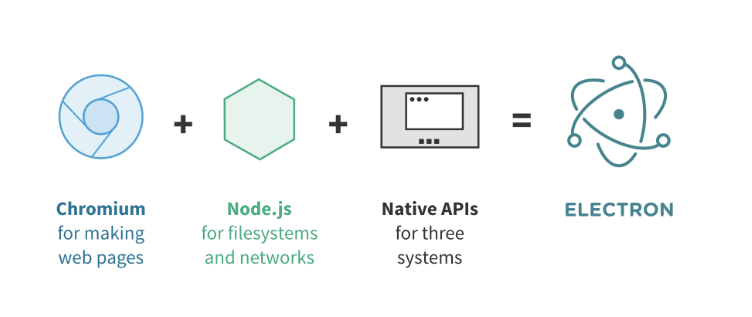

# Electron： HTML + Javascript 开发桌面应用程序

> 本文链接：https://blog.csdn.net/yjwx0018/article/details/52431716

## 简介

* 概述：Electron 前称为atom shell，是从github开源项目Atom编辑器中抽离出来的，是一个能让你通过 JavaScript、HTML 和 CSS 构建桌面应用的库 。这些应用能打包到 Mac、Windows 和 Linux 电脑上运行。
* 组成：Electron 结合了 Chromium、Node.js和用于调用3个操作系统本地功能的API（如打开文件窗口、通知、图标等）
  * 
  * Chromium：Google 创造的一个开源库，并用于 Google 的浏览器 Chrome；
  * Node.js(Node)：一个用于在服务器运行JavaScript的工具，拥有文件系统和网络的权限；
  * Native API：支持3个操作系统（Windows、Mac和Linux）的原生API库。
  * 开发体验：跟网页开发很相似，通过HTML和CSS搭建界面，使用Node（JavaScript）编写逻辑，就像开发一个Node应用。

## 使用该技术的部分产品

* 网易云音乐PC客户端
* 有道词典PC客户端 （基于heX）
* Atom文本编辑器 （基于Electron）
* Visual Studio Code编辑器 （基于Electron）

## 相关技术

* C++ / CEF: https://bitbucket.org/chromiumembedded/cef
  * CEF (Chromium Embedded Framework)
  * 谷歌浏览器嵌入式框架，即谷歌浏览器内核，配合C++使用。
* Electron: http://electron.atom.io/
  * Electron基于Node.js，使用javascript编程。
* 个人对Node.js的理解
  * Node.js是一个JavaScript 解释器，是类似Python的东西
  * Node.js使用JavaScript语言，Python使用Python语言
  * Node.js常用于编写Web服务器（使用http等模块）
  * Python也有类似的框架，比如Django
* NW.js : http://nwjs.io/
  * NW.js 原名 node-webkit
  * 基于 Chromium 和 Node.js
* heX:http://hex.youdao.com/
  * heX是有道发起的开源项目
  * 基于开源项目 CEF，它内部整合了开源项目 Chromium 及 Node.JS

## 安装

* 安装Node.js和 Electron
  * sudo apt-get install gcc g++ make
  * sudo apt-get install curl
  * curl -sL https://deb.nodesource.com/setup_8.x | sudo -E bash -
  * sudo apt-get install -y nodejs
  * sudo npm install -g cnpm --registry=https://registry.npm.taobao.org
  * sudo cnpm install -g electron

## 简单案例

* Clone this repository
  * git clone https://github.com/electron/electron-quick-start
* Go into the repository
  * cd electron-quick-start
* Install dependencies
  * cnpm install
* Run the app
  * cnpm start
  